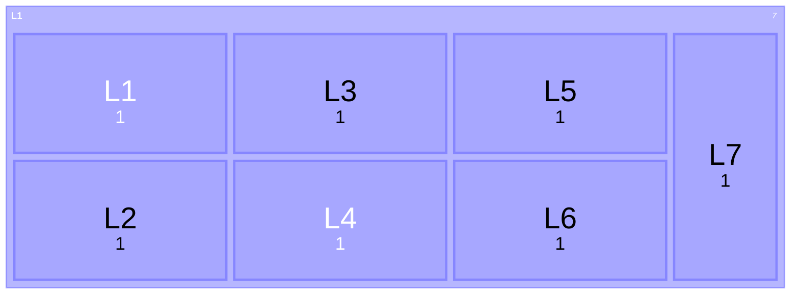
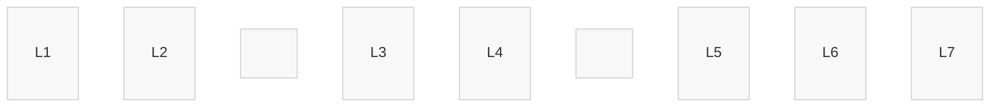

## (9)2 — The Reality Engine

### 21 Resources

> yyh

#### 211 Generic Model

##### 2111 Main

State of Potential → Quantization → Representation

Energy (Potential) → Bit (Logic) → Pixel (Atom) → Stream (Flow) → Container (Structure) → Playback (Perception)

At each transition, entropy decreases, meaning increases, and bandwidth condenses.

Bandwidth hierarchy:

Physical energy → infinite continuity

Quantized logic → discrete bandwidth (Hz, bps)

Streams/containers → encoded rate (kbps → Mbps → Gbps)

Playback → perceptual throughput (frames/s × pixels/frame × channels)

##### 2112 Classes

??? note  "1. Decode"
- Geometry & Instruction Orchestration Command decoding and geometry assembly
- Model → View → Projection → Viewport transformations
- Culling & clipping for efficiency

??? note "2. Render"
- Transformation & Materialization

```
- Vertex processing: transforms spatial coordinates

- Rasterization: converts geometry to pixel grids

- Fragment shading: per-pixel lighting & BRDF logic

- Pre-merge output: early tests and discard optimization
```

??? note "3. SyncLogicS"
- Temporal-Spatial Reconciliation

```
- Depth and stencil tests ensure spatial coherence

- Alpha blending and MSAA resolve ensure temporal smoothness

- Frame composition merges concurrent light states
```

??? note "4. Enhancer"
- Perceptual & Predictive Refinement:

```
- AI-based super-resolution, denoising, tone mapping

- HDR adaptation, color correction, perceptual compression

- Video encoding, display streaming, or storage preparation
```

##### 2113 Methods

### 22 Inputs

### 23 Process

### 24 Output

```mermaid
graph LR
    classDef box fill:#111,stroke:#999,stroke-width:1px,padding:2px;
    L1[L1]:::box
    L2[L2]:::box
    L3[L3]:::box
    L4[L4]:::box
    L5[L5]:::box
    L6[L6]:::box
    L7[L7]:::box

    L1 --- L2 --- L3 --- L4 --- L5 --- L6 --- L7
```






